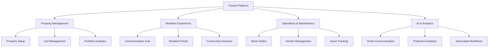

# Travtus Platform Overview

Travtus is a comprehensive property management platform powered by AI and designed to streamline operations, enhance resident experiences, and provide deep insights into your portfolio performance.

## 🏗️ **What is Travtus?**

Travtus combines traditional property management tools with cutting-edge AI technology to create a unified platform that handles everything from resident communication to maintenance coordination, financial tracking, and operational analytics.

<CardGroup cols={2}>
  <Card title="AI-Powered" icon="brain">
    Intelligent automation for communication, task management, and insights
  </Card>
  <Card title="Comprehensive" icon="building-columns">
    Complete property management solution in one integrated platform
  </Card>
  <Card title="Scalable" icon="chart-line-up">
    Grows with your portfolio from single properties to large enterprises
  </Card>
  <Card title="Connected" icon="link">
    Integrates with existing tools and systems via APIs and webhooks
  </Card>
</CardGroup>

## 🎯 **Core Capabilities**

### **Property & Portfolio Management**
- **Property Setup**: Organize properties, buildings, units, and amenities
- **Unit Management**: Track availability, occupancy, and unit details
- **Portfolio Analytics**: Monitor performance across your entire portfolio
- **Financial Tracking**: Rent collection, expenses, and financial reporting

### **Resident Experience**
- **Communication Hub**: Email, SMS, and in-app messaging
- **Resident Portal**: Self-service portal for residents
- **Maintenance Requests**: Streamlined request and tracking system
- **Community Building**: Events, announcements, and resident engagement

### **Operations & Maintenance**
- **Work Order Management**: Create, assign, and track maintenance tasks
- **Vendor Management**: Coordinate with contractors and service providers
- **Preventive Maintenance**: Schedule and automate routine maintenance
- **Asset Tracking**: Monitor equipment and property assets

### **AI & Automation**
- **Smart Communication**: AI-powered message generation and routing
- **Predictive Analytics**: Identify trends and potential issues
- **Automated Workflows**: Streamline repetitive tasks and processes
- **Intelligent Insights**: Data-driven recommendations and alerts

## 🏢 **Who Uses Travtus?**

### **Property Management Companies**
- Manage multiple properties and portfolios
- Standardize operations across locations
- Scale efficiently with growth
- Provide consistent resident experiences

### **Individual Property Owners**
- Simplify property management tasks
- Improve resident communication
- Track financial performance
- Automate routine operations

### **Real Estate Developers**
- Manage properties from development to operation
- Track leasing and occupancy metrics
- Coordinate construction and maintenance
- Analyze portfolio performance

### **Corporate Housing Providers**
- Handle short-term and extended stays
- Manage complex pricing and availability
- Coordinate with corporate clients
- Streamline check-in/check-out processes

## 🔧 **Key Features by Role**

### **For Property Managers**
<Accordion title="Daily Operations">
- **Dashboard**: Real-time overview of all properties and key metrics
- **Resident Communication**: Send targeted messages and announcements
- **Maintenance Coordination**: Create, assign, and track work orders
- **Leasing Management**: Handle applications, leases, and move-ins/outs
- **Financial Tracking**: Monitor rent collection and expenses
</Accordion>

<Accordion title="Reporting & Analytics">
- **Occupancy Reports**: Track vacancy rates and leasing performance
- **Financial Reports**: Revenue, expenses, and profitability analysis
- **Maintenance Reports**: Work order completion and vendor performance
- **Resident Satisfaction**: Communication engagement and feedback metrics
</Accordion>

### **For Administrators**
<Accordion title="System Management">
- **User Management**: Add team members and assign roles
- **Permission Control**: Define access levels and security policies
- **Integration Setup**: Connect third-party services and tools
- **Data Management**: Import/export data and maintain data quality
</Accordion>

<Accordion title="Configuration">
- **System Settings**: Customize platform behavior and preferences
- **Workflow Automation**: Set up automated processes and triggers
- **Compliance Management**: Ensure regulatory compliance and audit trails
- **Performance Monitoring**: Track system usage and performance metrics
</Accordion>

### **For Developers**
<Accordion title="Integration Capabilities">
- **REST APIs**: Complete API access for all platform functionality
- **Webhooks**: Real-time event notifications and data synchronization
- **Data Import/Export**: Bulk data operations and migration tools
- **Custom Integrations**: Build custom solutions and workflows
</Accordion>

<Accordion title="Development Tools">
- **API Documentation**: Comprehensive guides and examples
- **SDKs**: Libraries for popular programming languages
- **Testing Tools**: Sandbox environments and testing utilities
- **Support**: Technical support and developer resources
</Accordion>

## 🌟 **What Makes Travtus Different?**

### **AI-First Approach**
Unlike traditional property management software, Travtus is built with AI at its core:
- **Intelligent Communication**: AI suggests responses and automates routine communications
- **Predictive Maintenance**: Identify potential issues before they become problems
- **Smart Insights**: Automatically surface important trends and opportunities
- **Automated Workflows**: Reduce manual work with intelligent automation

### **Modern Architecture**
- **Cloud-Native**: Scalable, secure, and always up-to-date
- **Mobile-First**: Full functionality on any device
- **API-Driven**: Integrate with any system or build custom solutions
- **Real-Time**: Live data updates and instant notifications

### **Comprehensive Integration**
- **Email Providers**: Office 365, Gmail, and other email systems
- **Communication**: Twilio for SMS, various chat platforms
- **Accounting**: QuickBooks, Yardi, and other financial systems
- **Maintenance**: Connect with vendor management systems

## 📊 **Platform Architecture**

## 🚀 **Getting Started**

Ready to explore Travtus? Here's how to begin:

<Steps>
  <Step title="Set Up Your Account">
    Complete your [account setup](/getting-started/account-setup) and configure your profile
  </Step>
  <Step title="Choose Your Path">
    Follow the [quick start guide](/getting-started/quick-start) based on your role
  </Step>
  <Step title="Explore Features">
    Dive into the [user guide](/user-guide/features/dashboard-analytics) to learn specific features
  </Step>
  <Step title="Get Support">
    Access our [support resources](/support/overview) whenever you need help
  </Step>
</Steps>

## 📈 **Success Metrics**

Organizations using Travtus typically see:

<CardGroup cols={2}>
  <Card title="40% Reduction" icon="clock">
    In time spent on routine administrative tasks
  </Card>
  <Card title="25% Improvement" icon="chart-line">
    In resident satisfaction and retention
  </Card>
  <Card title="30% Faster" icon="bolt">
    Maintenance request resolution times
  </Card>
  <Card title="50% Less" icon="envelope">
    Manual communication and follow-up work
  </Card>
</CardGroup>

## 🔗 **Integration Ecosystem**

Travtus connects with the tools you already use:

- **Communication**: Office 365, Google Workspace, Twilio, Slack
- **Accounting**: QuickBooks, Yardi, MRI Software, RealPage
- **Maintenance**: ServiceTitan, FieldEdge, various CMMS systems
- **Marketing**: Mailchimp, Constant Contact, social media platforms
- **Analytics**: Google Analytics, business intelligence tools

## 🛡️ **Security & Compliance**

- **Data Encryption**: End-to-end encryption for all data transmission and storage
- **Access Control**: Role-based permissions and multi-factor authentication
- **Compliance**: SOC 2, GDPR, and industry-specific compliance standards
- **Backup & Recovery**: Automated backups and disaster recovery procedures

## 💡 **What's Next?**

Now that you understand what Travtus can do, it's time to get started:

<CardGroup cols={3}>
  <Card title="Set Up Account" icon="user-plus" href="/getting-started/account-setup">
    Complete your account configuration
  </Card>
  <Card title="Quick Start" icon="rocket" href="/getting-started/quick-start">
    Jump into your role-specific guide
  </Card>
  <Card title="Browse Features" icon="compass" href="/user-guide/features/dashboard-analytics">
    Explore all platform capabilities
  </Card>
</CardGroup>

---

*Ready to transform your property management operations? Let's get started!*
