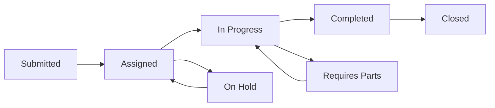

# Maintenance Tasks & Work Orders

Effective maintenance management is crucial for resident satisfaction and property value preservation. Travtus provides comprehensive tools to create, assign, track, and analyze maintenance tasks and work orders across your entire portfolio.

## 🔧 **Maintenance System Overview**

<CardGroup cols={2}>
  <Card title="Work Order Management" icon="clipboard-list">
    Create, assign, and track maintenance requests from submission to completion
  </Card>
  <Card title="Vendor Coordination" icon="users">
    Manage contractor relationships, scheduling, and performance tracking
  </Card>
  <Card title="Preventive Maintenance" icon="calendar">
    Schedule and automate routine maintenance to prevent issues
  </Card>
  <Card title="Asset Tracking" icon="wrench">
    Monitor equipment condition and maintenance history
  </Card>
</CardGroup>

## 📝 **Work Order Lifecycle**

### **Work Order Status Flow**

<Steps>
  <Step title="Submission">
    Work orders are created by residents, staff, or automatically through inspections
  </Step>
  <Step title="Assessment">
    Maintenance team reviews priority, assigns resources, and estimates completion
  </Step>
  <Step title="Assignment">
    Work orders are assigned to internal staff or external vendors
  </Step>
  <Step title="Execution">
    Work is performed with progress updates and photo documentation
  </Step>
  <Step title="Completion">
    Work is completed, inspected, and resident satisfaction is confirmed
  </Step>
</Steps>

## 🎯 **Creating Work Orders**

### **Work Order Sources**

<Tabs>
  <Tab title="Resident Requests">
    **Resident-Submitted Requests**:
    - Online portal submissions
    - Mobile app requests
    - Phone call requests
    - Email requests
    - Emergency hotline calls
    
    **Automatic Information Capture**:
    - Resident contact information
    - Unit location and details
    - Request timestamp
    - Photos and descriptions
  </Tab>
  
  <Tab title="Staff Inspections">
    **Property Inspections**:
    - Routine property walk-throughs
    - Unit turnover inspections
    - Preventive maintenance checks
    - Safety inspections
    - Vendor recommendations
    
    **Inspection Tools**:
    - Digital inspection checklists
    - Photo documentation
    - Voice-to-text notes
    - Immediate work order creation
  </Tab>
  
  <Tab title="Automated Creation">
    **System-Generated Requests**:
    - Preventive maintenance schedules
    - Equipment monitoring alerts
    - Warranty expiration reminders
    - Seasonal maintenance tasks
    - Compliance requirement alerts
    
    **Smart Triggers**:
    - Time-based scheduling
    - Usage-based intervals
    - Condition-based alerts
    - Weather-triggered tasks
  </Tab>
</Tabs>

### **Work Order Details**

<Accordion title="Essential Information">
**Basic Details**:
- Work order number and priority level
- Location (property, building, unit)
- Category and subcategory
- Description and resident notes
- Photos and attachments

**Assignment Information**:
- Assigned technician or vendor
- Estimated completion date
- Required skills and certifications
- Special instructions or access requirements
</Accordion>

<Accordion title="Priority Levels">
**Emergency (Response within 24 hours)**:
- No heat/AC in extreme weather
- Plumbing leaks causing damage
- Electrical hazards
- Security system failures
- Lockouts after hours

**Urgent (Response within 2-3 days)**:
- Appliance failures
- Minor plumbing issues
- HVAC not working (moderate weather)
- Pest control needs
- Safety concerns

**Routine (Response within 5-7 days)**:
- Cosmetic repairs
- Non-essential appliance issues
- General maintenance requests
- Preventive maintenance tasks
</Accordion>

## 👥 **Vendor Management**

### **Vendor Database**

<CardGroup cols={2}>
  <Card title="Vendor Profiles" icon="id-card">
    - Contact information and specialties
    - Licensing and insurance tracking
    - Performance ratings and history
    - Pricing and contract terms
  </Card>
  <Card title="Scheduling Integration" icon="calendar">
    - Vendor availability calendars
    - Automatic scheduling conflicts
    - Appointment confirmations
    - Rescheduling notifications
  </Card>
  <Card title="Performance Tracking" icon="chart-line">
    - Response time metrics
    - Quality ratings from residents
    - Cost analysis and trends
    - Completion rate statistics
  </Card>
  <Card title="Communication Hub" icon="messages">
    - Direct messaging with vendors
    - Work order updates and photos
    - Invoice and payment tracking
    - Performance feedback
  </Card>
</CardGroup>

### **Vendor Assignment**

<Steps>
  <Step title="Automatic Assignment">
    System suggests vendors based on location, specialty, availability, and performance
  </Step>
  <Step title="Manual Selection">
    Override automatic assignments when specific vendors are required
  </Step>
  <Step title="Vendor Confirmation">
    Vendors confirm availability and provide estimated completion times
  </Step>
  <Step title="Resident Notification">
    Residents receive updates about assigned vendors and appointment times
  </Step>
</Steps>

## 📅 **Preventive Maintenance**

### **Preventive Maintenance Programs**

<Tabs>
  <Tab title="HVAC Systems">
    **Scheduled Tasks**:
    - Filter replacements (monthly/quarterly)
    - System inspections (semi-annual)
    - Duct cleaning (annual)
    - Thermostat calibration
    - Refrigerant level checks
    
    **Benefits**:
    - Improved energy efficiency
    - Extended equipment life
    - Reduced emergency repairs
    - Better air quality
  </Tab>
  
  <Tab title="Plumbing Systems">
    **Routine Maintenance**:
    - Water heater inspections
    - Pipe insulation checks
    - Drain cleaning
    - Faucet and fixture maintenance
    - Water pressure testing
    
    **Seasonal Tasks**:
    - Winterization procedures
    - Sprinkler system maintenance
    - Pool equipment servicing
    - Outdoor faucet preparation
  </Tab>
  
  <Tab title="Common Areas">
    **Regular Upkeep**:
    - Lighting maintenance and bulb replacement
    - Landscaping and grounds keeping
    - Cleaning schedules
    - Safety equipment testing
    - Signage updates and repairs
    
    **Amenity Maintenance**:
    - Pool and spa maintenance
    - Fitness equipment servicing
    - Playground inspections
    - Parking lot maintenance
  </Tab>
</Tabs>

### **Preventive Maintenance Scheduling**

<Accordion title="Schedule Types">
**Time-Based Scheduling**:
- Daily, weekly, monthly, quarterly, or annual tasks
- Seasonal maintenance programs
- Calendar-based reminders and notifications

**Usage-Based Scheduling**:
- Equipment hour meters and usage tracking
- Cycle-based maintenance intervals
- Performance threshold triggers

**Condition-Based Scheduling**:
- Equipment monitoring and sensors
- Inspection-based maintenance triggers
- Predictive maintenance algorithms
</Accordion>

## 📊 **Maintenance Analytics & Reporting**

### **Key Performance Metrics**

<CardGroup cols={2}>
  <Card title="Response Times" icon="clock">
    - Average response time by priority level
    - Response time trends over time
    - Comparison against SLA targets
    - Response time by vendor or technician
  </Card>
  <Card title="Completion Rates" icon="check-circle">
    - Work order completion percentages
    - On-time completion rates
    - First-time fix rates
    - Repeat request tracking
  </Card>
  <Card title="Cost Analysis" icon="dollar-sign">
    - Maintenance costs per unit
    - Cost trends and budget variance
    - Vendor cost comparisons
    - Preventive vs. reactive cost ratios
  </Card>
  <Card title="Resident Satisfaction" icon="star">
    - Work completion satisfaction scores
    - Response time satisfaction
    - Quality of work ratings
    - Communication effectiveness scores
  </Card>
</CardGroup>

### **Maintenance Reports**

<Tabs>
  <Tab title="Operational Reports">
    **Daily/Weekly Operations**:
    - Open work order summaries
    - Priority request alerts
    - Vendor schedule reports
    - Cost tracking summaries
    
    **Monthly Analysis**:
    - Maintenance volume trends
    - Category breakdown analysis
    - Vendor performance reviews
    - Budget vs. actual reports
  </Tab>
  
  <Tab title="Strategic Reports">
    **Portfolio Analysis**:
    - Property comparison reports
    - Asset condition assessments
    - Capital planning recommendations
    - ROI analysis for improvements
    
    **Predictive Insights**:
    - Equipment replacement forecasts
    - Seasonal maintenance planning
    - Budget forecasting
    - Risk assessment reports
  </Tab>
  
  <Tab title="Compliance Reports">
    **Regulatory Compliance**:
    - Safety inspection reports
    - Code compliance tracking
    - Warranty status reports
    - Insurance claim documentation
    
    **Audit Preparation**:
    - Maintenance history reports
    - Vendor certification tracking
    - Cost justification reports
    - Performance benchmark reports
  </Tab>
</Tabs>

## 📱 **Mobile Maintenance Management**

### **Mobile App Features**

<CardGroup cols={2}>
  <Card title="Field Updates" icon="mobile">
    Technicians can update work order status, add photos, and complete tasks from the field
  </Card>
  <Card title="Inventory Tracking" icon="boxes">
    Track parts usage, inventory levels, and automatic reorder notifications
  </Card>
  <Card title="Photo Documentation" icon="camera">
    Before/after photos, progress updates, and quality documentation
  </Card>
  <Card title="Resident Communication" icon="chat">
    Direct communication with residents about maintenance progress and completion
  </Card>
</CardGroup>

### **Mobile Workflow**

<Steps>
  <Step title="Work Order Receipt">
    Technicians receive push notifications for new assignments
  </Step>
  <Step title="Pre-Visit Preparation">
    Review work order details, resident notes, and unit history
  </Step>
  <Step title="On-Site Updates">
    Update status, add photos, and communicate with residents
  </Step>
  <Step title="Completion Documentation">
    Record work performed, parts used, and resident satisfaction
  </Step>
</Steps>

## 🔍 **Advanced Maintenance Features**

### **Predictive Maintenance**

<Info>
**AI-Powered Insights**: Travtus analyzes maintenance patterns to predict equipment failures and optimize maintenance schedules.
</Info>

**Predictive Capabilities**:
- **Equipment Failure Prediction**: Identify equipment likely to fail based on age, usage, and maintenance history
- **Optimal Maintenance Timing**: Determine the best time to perform maintenance based on cost and convenience
- **Parts Inventory Optimization**: Predict parts needs and optimize inventory levels
- **Vendor Performance Forecasting**: Predict vendor performance and adjust assignments accordingly

### **Integration Capabilities**

<Accordion title="Smart Building Integration">
- IoT sensor data integration for real-time equipment monitoring
- Automated alerts for equipment malfunctions
- Energy usage monitoring and optimization
- Environmental condition tracking
</Accordion>

<Accordion title="Accounting System Integration">
- Automatic expense categorization and coding
- Budget tracking and variance reporting
- Vendor payment processing
- Cost allocation to properties and units
</Accordion>

<Accordion title="Vendor Portal Integration">
- Direct work order assignment to vendor systems
- Real-time status updates from vendor platforms
- Automated invoice processing and approval
- Performance data exchange
</Accordion>

## 🎯 **Maintenance Best Practices**

### **Efficient Work Order Management**

<Steps>
  <Step title="Standardize Processes">
    Create consistent workflows for different types of maintenance requests
  </Step>
  <Step title="Set Clear Priorities">
    Establish clear priority levels and response time expectations
  </Step>
  <Step title="Communicate Proactively">
    Keep residents informed throughout the maintenance process
  </Step>
  <Step title="Document Everything">
    Maintain detailed records of all maintenance activities and outcomes
  </Step>
</Steps>

### **Vendor Relationship Management**

<Tip>
**Build Strong Partnerships**: Develop long-term relationships with reliable vendors who understand your properties and standards.
</Tip>

<Tip>
**Performance Monitoring**: Regularly review vendor performance and provide feedback to maintain high service levels.
</Tip>

<Tip>
**Competitive Pricing**: Periodically review pricing and compare with market rates to ensure cost-effectiveness.
</Tip>

### **Preventive Maintenance Strategy**

<Accordion title="Program Development">
1. **Asset Inventory**: Create comprehensive inventory of all equipment and systems
2. **Maintenance Schedules**: Develop maintenance schedules based on manufacturer recommendations
3. **Resource Planning**: Allocate appropriate staff and budget for preventive maintenance
4. **Performance Tracking**: Monitor the effectiveness of preventive maintenance programs
</Accordion>

## 🆘 **Troubleshooting Maintenance Issues**

### **Common Problems**

<Accordion title="Work Orders Not Being Completed">
**Possible Causes**:
- Insufficient vendor capacity or availability
- Unclear work order descriptions or requirements
- Parts or materials not available
- Access issues or resident unavailability

**Solutions**:
- Expand vendor network and capacity
- Improve work order detail and clarity
- Implement better inventory management
- Improve resident communication and scheduling
</Accordion>

<Accordion title="High Maintenance Costs">
**Possible Causes**:
- Reactive rather than preventive maintenance approach
- Inefficient vendor management and pricing
- Aging equipment requiring frequent repairs
- Inadequate maintenance planning and budgeting

**Solutions**:
- Implement comprehensive preventive maintenance programs
- Negotiate better vendor contracts and pricing
- Plan for equipment replacement and upgrades
- Improve maintenance budgeting and forecasting
</Accordion>

<Accordion title="Low Resident Satisfaction">
**Possible Causes**:
- Poor communication about maintenance activities
- Slow response times to maintenance requests
- Quality issues with completed work
- Inconvenient scheduling and access requirements

**Solutions**:
- Improve communication throughout the maintenance process
- Optimize workflows to reduce response times
- Implement quality control and inspection processes
- Offer flexible scheduling options for residents
</Accordion>

## 📞 **Getting Help**

- **Maintenance Setup**: Get assistance setting up maintenance workflows and vendor networks
- **Integration Support**: Help connecting with existing maintenance management systems
- **Training**: Access training resources for maintenance team members
- **Best Practices**: Schedule consultations to optimize maintenance operations

---

*Effective maintenance management improves resident satisfaction, preserves property value, and controls operating costs. Use Travtus tools to streamline your maintenance operations and deliver exceptional service to your residents.*
