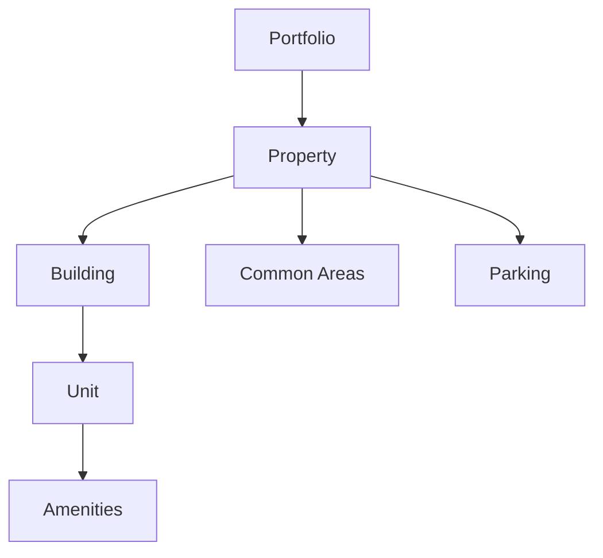

# Property Management

Efficient property management starts with proper organization of your properties, units, and amenities. This guide will help you set up and manage your property portfolio in Travtus for optimal operations and reporting.

## 🏢 **Property Structure Overview**

Travtus organizes your real estate portfolio in a hierarchical structure:

<CardGroup cols={2}>
  <Card title="Portfolio Level" icon="building-columns">
    Your entire collection of properties managed in Travtus
  </Card>
  <Card title="Property Level" icon="building">
    Individual properties or complexes with their own management
  </Card>
  <Card title="Building Level" icon="home">
    Separate buildings within a property (for multi-building complexes)
  </Card>
  <Card title="Unit Level" icon="door-open">
    Individual rental units, apartments, or spaces
  </Card>
</CardGroup>

## 🏗️ **Adding Your First Property**

### **Property Setup Wizard**

<Steps>
  <Step title="Basic Information">
    - Property name and address
    - Property type (apartment complex, single-family, etc.)
    - Number of buildings and units
    - Management contact information
  </Step>
  <Step title="Property Details">
    - Year built and last renovation
    - Total square footage
    - Parking spaces available
    - Pet policies and restrictions
  </Step>
  <Step title="Amenities & Features">
    - Common amenities (pool, gym, laundry, etc.)
    - Unit features (in-unit laundry, balconies, etc.)
    - Accessibility features
    - Utility inclusions
  </Step>
  <Step title="Financial Settings">
    - Base rent ranges
    - Security deposit amounts
    - Fee structures
    - Utility billing preferences
  </Step>
</Steps>

### **Property Types Supported**

<Tabs>
  <Tab title="Multi-Family">
    **Apartment Complexes & Communities**
    - Multiple buildings with shared amenities
    - Centralized management office
    - Common areas and facilities
    - Bulk utility billing options
    
    **Typical Setup**:
    - Property → Buildings → Units
    - Shared amenity tracking
    - Community-wide policies
  </Tab>
  
  <Tab title="Single-Family">
    **Houses & Townhomes**
    - Individual properties with unique addresses
    - Private amenities (yards, garages, etc.)
    - Individual utility accounts
    - Property-specific maintenance
    
    **Typical Setup**:
    - Property = Unit (1:1 relationship)
    - Individual amenity tracking
    - Property-specific policies
  </Tab>
  
  <Tab title="Mixed-Use">
    **Commercial & Residential Combined**
    - Retail/office spaces with residential units
    - Different lease terms and structures
    - Separate management considerations
    - Varied amenity access
    
    **Typical Setup**:
    - Property → Unit Types → Specific Units
    - Amenity access controls
    - Multiple lease templates
  </Tab>
</Tabs>

## 🏠 **Unit Management**

### **Unit Setup & Configuration**

<Accordion title="Unit Details">
**Basic Information**:
- Unit number/identifier
- Square footage and room count
- Floor plan type
- Rent amount and lease terms
- Security deposit requirements

**Physical Features**:
- Bedroom and bathroom count
- Balcony/patio availability
- Storage spaces included
- Appliances and fixtures
- Flooring and finishes
</Accordion>

<Accordion title="Unit Status Management">
**Occupancy Status**:
- **Occupied**: Currently leased with active resident
- **Available**: Ready for immediate occupancy
- **Make-Ready**: Being prepared between residents
- **Maintenance**: Temporarily unavailable for repairs
- **Model**: Used for tours and marketing

**Status Workflow**:
- Automatic status updates based on lease dates
- Manual status changes with reason tracking
- Maintenance hold capabilities
- Availability scheduling
</Accordion>

### **Unit Customization**

<CardGroup cols={2}>
  <Card title="Floor Plans" icon="blueprint">
    - Upload floor plan images
    - Link units to floor plan types
    - Display in resident portal
    - Use for marketing materials
  </Card>
  <Card title="Unit Photos" icon="camera">
    - Multiple photos per unit
    - Before/after maintenance photos
    - Marketing photo galleries
    - Virtual tour integration
  </Card>
  <Card title="Amenity Tracking" icon="star">
    - Unit-specific amenities
    - Amenity condition tracking
    - Maintenance history
    - Replacement scheduling
  </Card>
  <Card title="Custom Fields" icon="edit">
    - Property-specific data fields
    - Compliance tracking
    - Special notes and alerts
    - Historical information
  </Card>
</CardGroup>

## 🎯 **Amenity Management**

### **Common Amenities**

<Tabs>
  <Tab title="Recreational">
    **Fitness & Recreation**:
    - Fitness center/gym
    - Swimming pool and spa
    - Tennis/basketball courts
    - Playground areas
    - Walking trails
    
    **Management Features**:
    - Hours of operation
    - Capacity limits
    - Maintenance schedules
    - Usage tracking
  </Tab>
  
  <Tab title="Convenience">
    **Daily Life Amenities**:
    - Laundry facilities
    - Business center
    - Package receiving
    - Parking spaces
    - Storage units
    
    **Management Features**:
    - Availability tracking
    - Reservation systems
    - Fee structures
    - Access control
  </Tab>
  
  <Tab title="Social">
    **Community Spaces**:
    - Clubhouse/community room
    - BBQ and picnic areas
    - Rooftop terraces
    - Game rooms
    - Event spaces
    
    **Management Features**:
    - Booking calendars
    - Event scheduling
    - Capacity management
    - Cleaning schedules
  </Tab>
</Tabs>

### **Amenity Maintenance & Tracking**

<Steps>
  <Step title="Condition Monitoring">
    Regular inspections and condition assessments for all amenities
  </Step>
  <Step title="Preventive Maintenance">
    Scheduled maintenance to keep amenities in optimal condition
  </Step>
  <Step title="Usage Analytics">
    Track which amenities are most popular and when they're used
  </Step>
  <Step title="Resident Feedback">
    Collect and respond to resident feedback about amenity conditions
  </Step>
</Steps>

## 📊 **Property Analytics & Reporting**

### **Key Performance Metrics**

<CardGroup cols={2}>
  <Card title="Occupancy Metrics" icon="chart-line">
    - Current occupancy percentage
    - Average days to lease
    - Renewal rates
    - Seasonal trends
  </Card>
  <Card title="Financial Performance" icon="dollar-sign">
    - Rent roll and collections
    - Revenue per unit
    - Operating expense ratios
    - Net operating income
  </Card>
  <Card title="Maintenance Metrics" icon="wrench">
    - Work order volume
    - Average resolution time
    - Maintenance costs per unit
    - Preventive vs. reactive ratios
  </Card>
  <Card title="Resident Satisfaction" icon="heart">
    - Satisfaction survey scores
    - Complaint resolution times
    - Amenity usage rates
    - Renewal likelihood scores
  </Card>
</CardGroup>

### **Custom Reporting**

Create detailed property reports for:
- **Owner Reporting**: Monthly financial and operational summaries
- **Compliance**: Required regulatory and certification reports
- **Marketing**: Occupancy and pricing analysis for marketing strategies
- **Budgeting**: Historical performance for budget planning

## 🔧 **Property Maintenance Management**

### **Preventive Maintenance Programs**

<Accordion title="HVAC Systems">
- Filter replacement schedules
- Seasonal system inspections
- Duct cleaning programs
- Energy efficiency monitoring
</Accordion>

<Accordion title="Common Areas">
- Landscaping and grounds keeping
- Lighting maintenance and upgrades
- Cleaning schedules and standards
- Safety equipment inspections
</Accordion>

<Accordion title="Building Systems">
- Plumbing system maintenance
- Electrical system inspections
- Fire safety system testing
- Security system maintenance
</Accordion>

### **Maintenance Tracking**

- **Work Order Management**: Create, assign, and track all maintenance requests
- **Vendor Coordination**: Manage contractor relationships and performance
- **Cost Tracking**: Monitor maintenance expenses by category and property
- **Warranty Management**: Track equipment warranties and service contracts

## 🏢 **Multi-Property Management**

### **Portfolio Overview**

For property management companies or large portfolios:

<CardGroup cols={2}>
  <Card title="Centralized Dashboard" icon="layout-dashboard">
    View key metrics across all properties in one consolidated view
  </Card>
  <Card title="Comparative Analysis" icon="chart-bar">
    Compare performance metrics between different properties
  </Card>
  <Card title="Standardized Processes" icon="cog">
    Apply consistent policies and procedures across all properties
  </Card>
  <Card title="Resource Allocation" icon="users">
    Efficiently distribute staff and resources across properties
  </Card>
</CardGroup>

### **Property Groups & Categories**

Organize properties by:
- **Geographic Region**: Group by city, state, or market area
- **Property Type**: Separate luxury, affordable, student housing, etc.
- **Management Team**: Assign properties to specific management teams
- **Investment Strategy**: Group by acquisition date, investment type, etc.

## 📱 **Mobile Property Management**

### **Mobile App Features**

<Tabs>
  <Tab title="Property Inspections">
    - Digital inspection checklists
    - Photo documentation
    - Condition scoring
    - Automated report generation
  </Tab>
  
  <Tab title="Unit Tours">
    - Mobile tour scheduling
    - Digital applications
    - Photo documentation
    - Immediate follow-up capabilities
  </Tab>
  
  <Tab title="Maintenance Oversight">
    - Work order status updates
    - Photo progress documentation
    - Vendor communication
    - Approval workflows
  </Tab>
</Tabs>

## 🎯 **Best Practices**

### **Property Setup**

<Tip>
**Start Simple**: Begin with basic property information and add details over time rather than trying to input everything at once.
</Tip>

<Tip>
**Consistent Naming**: Use consistent naming conventions for units (e.g., Building-Floor-Unit: A-2-05) to make searching and sorting easier.
</Tip>

<Tip>
**Photo Documentation**: Take comprehensive photos of each unit and common areas for reference and marketing purposes.
</Tip>

### **Ongoing Management**

<Steps>
  <Step title="Regular Updates">
    Keep property information current, especially amenity conditions and unit features
  </Step>
  <Step title="Performance Monitoring">
    Review property metrics weekly and investigate any concerning trends
  </Step>
  <Step title="Resident Feedback">
    Actively seek and respond to resident feedback about property conditions
  </Step>
  <Step title="Market Analysis">
    Regularly compare your property's performance to local market conditions
  </Step>
</Steps>

## 🔍 **Advanced Features**

### **Integration Capabilities**

- **Accounting Systems**: Sync with QuickBooks, Yardi, and other financial software
- **Marketing Platforms**: Integrate with ILS (Internet Listing Services) for automated advertising
- **Smart Home Technology**: Connect with smart locks, thermostats, and other IoT devices
- **Energy Management**: Track and optimize utility usage across properties

### **Compliance & Reporting**

- **Fair Housing**: Built-in compliance tracking and reporting
- **Safety Inspections**: Scheduled safety and compliance inspections
- **Insurance Requirements**: Track insurance policies and requirements
- **Regulatory Reporting**: Automated generation of required regulatory reports

## 🆘 **Troubleshooting**

### **Common Issues**

<Accordion title="Unit Status Not Updating">
**Problem**: Unit status doesn't change automatically
**Solutions**:
- Check lease end dates are entered correctly
- Verify automatic status update settings
- Manually update status if needed
- Contact support for workflow issues
</Accordion>

<Accordion title="Missing Property Data">
**Problem**: Property information appears incomplete
**Solutions**:
- Use the property setup wizard to fill in missing fields
- Import data from existing property management systems
- Gradually add information as it becomes available
- Use bulk update tools for multiple properties
</Accordion>

## 📞 **Getting Help**

- **Property Setup Assistance**: Contact support for help setting up complex properties
- **Data Migration**: Get help importing existing property data
- **Training Resources**: Access video tutorials for property management features
- **Best Practices**: Schedule a consultation to optimize your property setup

---

*Proper property organization is the foundation of efficient property management. Take time to set up your properties correctly, and you'll save time and improve accuracy in all your daily operations.*
